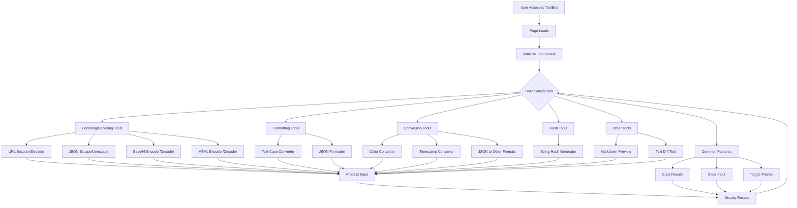

# Programmer's Toolbox

A comprehensive web-based collection of tools for developers, designed to simplify common programming tasks.

## Features

The Programmer's Toolbox includes the following utilities:

1. **URL Encoder/Decoder**: Encode or decode URL components
2. **JSON Escape/Unescape**: Escape or unescape JSON strings
3. **Base64 Encoder/Decoder**: Convert text to/from Base64 encoding
4. **HTML Encoder/Decoder**: Encode or decode HTML entities
5. **String Hash Generator**: Generate MD5, SHA-1, and SHA-256 hashes
6. **Timestamp Converter**: Convert between Unix timestamps and human-readable dates
7. **Markdown Preview**: Live preview of Markdown with HTML export
8. **Color Converter**: Convert between HEX, RGB, and HSL color formats
9. **Text Case Converter**: Transform text to various case formats (uppercase, lowercase, camelCase, etc.)
10. **JSON Formatter**: Format and validate JSON with pretty-print or minify options
11. **JSON to XML**: Convert JSON data to XML format
12. **JSON to Java/Python**: Generate Java or Python classes from JSON data
13. **JSON to YAML**: Convert JSON data to YAML format
14. **Text Diff**: Compare two text snippets and highlight the differences

## Project Flowchart

Below is a flowchart showing the functionality and user interaction flow of the Programmer's Toolbox:

This flowchart illustrates the main functionality and user interaction flow of the Programmer's Toolbox:

1. User accesses the Toolbox application
2. The page loads and initializes the tool panels
3. User can select different tools, including:
   - Encoding/Decoding tools: URL, JSON, Base64, HTML
   - Text formatting tools: Case conversion, JSON formatting
   - Conversion tools: Color conversion, Timestamp conversion, JSON to other formats
   - Hash generation tools: MD5, SHA1, SHA256
   - Other tools: Markdown preview, Text comparison
4. Each tool has specific functions and operations
5. Common features include: Copy results, Clear input, Toggle theme
6. After processing, results are displayed, and the user can continue to select other tools

## Usage

Simply open the `index.html` file in your web browser to use the toolbox. No server or installation required!

## Technologies Used

- HTML5
- CSS3
- JavaScript (ES6+)
- CryptoJS (for hash generation)
- Marked.js (for Markdown rendering)
- js-yaml (for YAML conversion)
- diff (for text comparison)
- vkbeautify (for XML formatting)

## Browser Compatibility

The Programmer's Toolbox works in all modern browsers:
- Chrome
- Firefox
- Safari
- Edge

## Local Development

1. Clone this repository
2. Open `index.html` in your browser
3. Make changes to the code as needed

## License

This project is open source and available under the [MIT License](https://opensource.org/licenses/MIT).

## Contributing

Contributions are welcome! Feel free to submit a pull request or open an issue if you have suggestions for improvements or new features. 